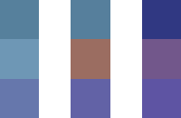

Breakdown of the visual style of The Sapling
============================================

| Technical | Graphics |

How was the graphical style of The Sapling is achieved? In this interactive breakdown I'll show you, step by step. At the bottom there's an interactive scene so you can turn all individual effects on and off.

Writing game code and creating game graphics are two fundamentally different beasts, and what is fun about them is very different. Programming has the clear advantage when I'm inspired by another game and want to see if I can replicate a particular idea. For example, if I encounter a game mechanic that I like, I can do a quick internet search and the result is most likely a tutorial on how to build this kind of technology. If I like the graphics in a game, on the other hand, there's not much I can do other than endlessly combining tricks I already know and hope this by chance achieves the graphical style I was trying to reproduce.

---

I'll set a good example and explain in detail how to achieve the visual style of The Sapling

---

In this article I'd like to show you it doesn't have to be this way; I'll set a good example and explain in detail how to achieve the visual style of The Sapling. I will do this step by step with sliders so you can compare the impact of the effect, and at the end with an interactive scene so you can turn on and off everything to your heart's desire.

Subdivision
-----------
The Catmull-Clark subdivision algorithm is like a machine where you can put in a simple 3D object, and a smooth more detailed object comes out. Fun fact: the Catmull in the name is actually Edwin Catmull, former president of Pixar and Walt Disney Animation Studios. Implementing it was my first experiment in Unity, and with it I showed myself that I was able to do 3D game programming. The algorithm allows the game to work with basic shapes for the models of plants and animals under the hood, while they appear more realistic to the player.

  

    
  

  

    
  

Depth of Field
--------------
Depth of field is a fancy term for making the background blurry. I really like depth of field in film and photography as it guides what the viewer focuses on in a very natural way. Unfortunately it often does not work well in gaming contexts: in most situations, the player should be able to focus wherever s/he wants. On top of this, depth of field makes objects feel relatively small; depth of field on anything larger than a human makes it look like some kind of miniature version - although recent city building sims use this to their advantage to create a 'toy city' kind of feel. In The Sapling, depth of field is used when the player clicks a plant or animal to focus on it. Look at the background in the image below to see the effect.

  

    
  

  

    
  

Vignette
--------
A vignette can be many things, but I think its default meaning is to make the corners of an image darker. Unlike depth of field, I rarely like vignettes in film and photography but I almost always do in games. I guess it's because a really simple trick that most players won't actively notice, while it does give the game a more artistic look.

  

    
  

  

    
  

Water animation
---------------
A comment a lot of early playtesters gave was that the island looked empty and boring when you start. While I still haven't come up with a way to really fix this, I think that moving water makes the whole thing feel a little more alive. If you're into the technical terms, it's achieved by saving the effect of displacement modifier in Blender as shapekeys. You can turn the moving water on and off in the interactive scene below.

Gradient skyboxes
-----------------
I came up with this idea quite late in the development of the game (before that, the sky in The Sapling was simply always blue), but the effect on the overal atmosphere was enormous. Interestingly, this can be achieved in the Unity game engine by using 3 pixel textures like these ones (enlarged versions):

This is the effect for a single point in the day night cycle with a slider for comparison. In the interactive scene below, you can actually move through the whole cycle.

  

    
  

  

    
  

Colored lights
--------------
Of course, beautiful skies only work when it matches the colors of the rest of the world. This is mostly achieved by simply changing the colors of the lights of the game along with the sky. Like with the skyboxes, you can see the effect for one point in the day night cycle here, and for the whole cycle in the interactive scene below the article.

  

    
  

  

    
  

Color correction
----------------
Color correction has the same goal as the colored lights (color the world to fit with the sky), but with a different approach. Whereas colored lights have much more effect, color corrections create a more unified and pretty look. This made them great together.

  

    
  

  

    
  

Interactive scene
-----------------

<button onclick="ToggleVignette()">Toggle vignette</button><button onclick="ToggleDepthOfField()">Toggle depth of field</button><button onclick="ToggleSubdivision()">Toggle subdivision</button><button onclick="ToggleAnimatedWater()">Toggle animated water</button><button onclick="ToggleColoredLights()">Toggle colored lights</button><button onclick="ToggleGradientSkyBox()">Toggle gradient skybox</button><button onclick="ToggleColorGrading()">Toggle color grading</button>

Slide to change where we are in the day-night cycle

<input type="range" min="1" max="100" value="50" id="dayNightCycleSlider">

  

  

  

  

Want more like this? I write articles like this roughly once per month; you can subscribe for email reminders below! If you want more fine-grained info on my game development work, there also is a [Twitter account](https://twitter.com/thesaplinggame).

13-02-20